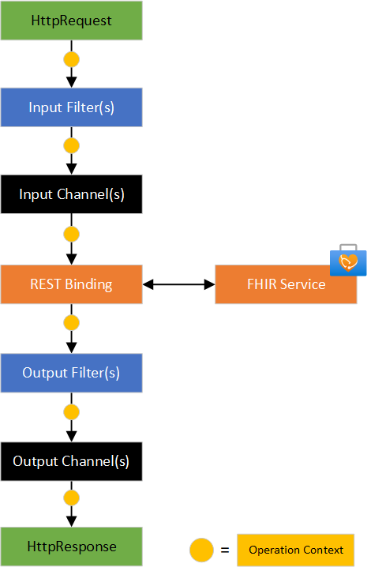

# Concepts

The core goal of this SDK is to build **custom operations** to extend the behavior of Azure Health Data Services. Abstractly, custom operations can:

- Modify the incoming requests.
- Acquire additional information to make decisions.
- Output information to Azure services.

On this page, we'll cover the components that are needed to build custom operations.

- **Operation Context**: Common object passed between components of a pipeline.
- **Pipeline**: Container for the actions of custom operations with filters, channels, and bindings.
- **Filter:** A unit of action that modifies the request and/or result via the Operation Context. Filters can be chained together in a single pipeline.
- **Channel:** Used to output data in a pipeline to an external system actor (ESA). This is usually an Azure service (like Storage, Event Hub, and/or Service Bus).
- **Binding:** The target service for a custom operation. Usually a FHIR service.

Pipeline Overview |  Input/Output Section of Pipeline
:-------------------------:|:-------------------------:
  | 

## Pipelines

Pipelines allow you to hook into existing .NET hosting platforms to build custom operations. Currently, there are two types of pipelines that you can use.

- **WebPipeline** for use with ASP.NET Web APIs in Azure App Services or other ASP.NET hosting platforms.
- **Azure Function Pipeline** for use with Azure Functions as an isolated process.

These pipelines allow you to hook into the configuration of ASP.NET and Azure Functions to use the other components below.

### Filters

Filters are a logical container for units of your custom operations. They are separated into input filters to modify the request before it goes to its destination (like FHIR Service). For complex custom operations, multiple filters can be chained together so pieces of logic can stay small, reusable, and testable.

Filters have a common interface which allow them to be used in a pipeline, since the properties, methods, and events can be hooked into the pipeline. Filters always input and output an operation context.

A Filter should be created from a factory and NOT be a singleton or static class, rather an instance per call.

To create a filter for custom logic, they must have:

| Name | Type | Description |
|------| ---- | ----------- |
| Id | Property | Unique Id for the filter (useful for logging). |
| Name | Property | Unique to the type of filter that can be used for create the filter from a factory. |
| ExecuteAsync | Method | An async method with an OperationContext as a argument and returns an OperationContext. |
| OnFilterError | Event | An event that is a trigger for filter errors, which can be used to terminate and dispose the pipeline. |

### Channels

Channels are an abstract way to communicate information in a pipeline to outside services. In practice, you can use channels to send information to other Azure services like Blob Storage or Service Bus. Channels are extensible - so custom channels can be built for any needed destination.

Channels can be send only, receive only, send and receive. Examples: (1) A channel for an event hub that only sends to the event hub (2) A service bus channel that on only receives from a specific topic (3) A TCP channel that can send and receive.

This SDK has prebuilt channels from Azure Blob Storage, Azure Event Hubs, and Azure Service Bus. All channels have:

| Name | Type | Description |
|------| ---- | ----------- |
| Id | Property | Unique Id for the filter (useful for logging). |
| Name | Property | Unique to the type of filter that can be used for create the filter from a factory. |
| IsEncrypted | Property | Indicates whether the channel is encrypted. |
| IsConnected | Property | Indicates whether the channel is connected. |
| IsAuthenticated | Property | Indicates whether the channel has authenticated. |
| Port | Property | The port used by the channel. |
| State | Property | Current channel state. A change SHOULD signal a StateChanged event. |
 OpenAsync | Method | Opens the channel. |
| CloseAsync | Method | Closes the channel. |
| SendAsync | Method | Sends a message on the channel. |
| ReceiveAsync | Method | Receives a message on the channel. |
| OnOpen | Event | Channel has opened. |
| OnClose | Event | Channel has closed. |
| OnError | Event | Channel has errored. |
| OnStateChange | Event | Chanel state has changed. |
| OnReceive | Event | Channel received a message. |

## Bindings

Bindings couple inputs and outputs in pipelines. The most common use of a binding is to send the current operation context to the FHIR service. This is done after zero or more input filters/channels and before zero or more output filter/channels.

| Name | Type | Description |
|------| ---- | ----------- |
| Id | Property | Unique Id of the binding. |
| Name | Property | Unique to the type of binding. |
| ExecuteAsync | Method | Executes the binding to send data. |
| BindingErrorEventArgs | Event | Signals an error on the binding. |
| BindingCompleteEventArgs | Event | Signals completion of a binding. |

## Transforms

This SDK has the ability to transform requests without using pipelines with prebuilt actions. We have two available which allow for simple modification of the headers and request body. These should be used for simple transforms that do not require logic (like always adding a header).

### Header Manipulation

- Modifies the operation context to add a header onto the request.
- Useful for adding headers, especially information about the requestor when not using on-behalf flow with the authenticator. 

*Add structure here*

### JSON Transform

- Can be done inside a pipeline or outside of a pipeline.
- Generally used to modify the body of a request to add missing data.

*Add structure here*

## Clients

- We have one client, Rest Request Client.
- This is a resilient client with retry built in.
- This is useful for getting additional information you need for your custom operation.
  - Can be part of the FHIR service or another arbitrary endpoint.
- You can use the `RestRequestBuilder` for easy creation.

*Add structure here*

## Authenticator

- Can allow for dynamic configuration or preset configuration.
- Supports
  -- Client credentials for local development or Azure deployments
  -  Managed Identity for Azure deployments
  - ...

*Add structure here*