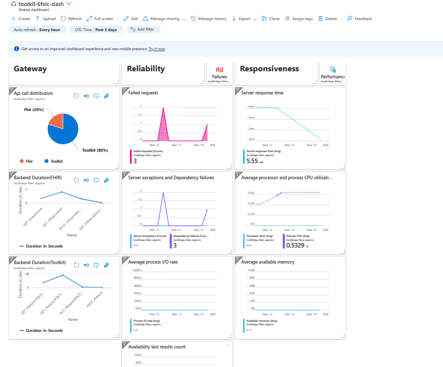

<!-----
page_type: sample
languages:
- csharp
products:
- azure
- azure-healthcare-apis
description: Get started quickly with the Azure Health Data Services Toolkit on Azure Functions
----->
# Azure Health Data Services Toolkit Azure Function Custom Operation Quickstart

This quickstart will walk you through creating a simple custom operation on top of the FHIR Service using Azure Functions. We'll cover everything from deploying infrastructure, debugging locally, and deploying to Azure.

*This sample does not address authorization for simplicity - the endpoint is open to anyone with the address. Please only use test or sample data for this quickstart.*

## Prerequisites

- An Azure account with an active subscription.
  - You need access to create resource groups, resources, and role assignments in Azure
- [.NET 7.0](https://dotnet.microsoft.com/download)
- [Azure Command-Line Interface (CLI)](https://docs.microsoft.com/cli/azure/install-azure-cli)
- [Azure Developer CLI](https://docs.microsoft.com/azure/developer/azure-developer-cli/get-started?tabs=bare-metal%2Cwindows&pivots=programming-language-csharp#prerequisites)
- Visual Studio or Visual Studio Code
  - For Visual Studio, you will need the Azure Functions Tools. To add Azure Function Tools, include the Azure development workload in your Visual Studio installation.
  - For Visual Studio Code, you will need to install the [Azure Function Core Tools](https://docs.microsoft.com/azure/azure-functions/functions-run-local?tabs=v4%2Cwindows%2Ccsharp%2Cportal%2Cbash#install-the-azure-functions-core-tools).

### Prerequisite check

- In a terminal or command window, run `dotnet --version` to check that the .NET SDK is version 6.0 or later.
- Run `az --version` and `azd version` to check that you have the appropriate Azure command-line tools installed.
- Login to the Azure CLI

## Setting up

This quickstart will create the below resources. These will be used both for local development and the Azure deployment.

- Azure Health Data Services workspace
- FHIR Service
- Function App (and associated storage account)
- APIM - [Azure API Management](https://learn.microsoft.com/azure/api-management/) (for Function App and Fhir Service)
- Log Analytics Workspace (for FHIR Service, Function App and APIM logs)
- Application Insights (for monitoring your custom operation)

### Deploy Quickstart

1. Make sure you have this repository cloned and up to date on your local system. Open the `samples/Quickstart` directory from this repository on your local system.
2. If you want to use an existing FHIR Service, you need to open `infra/main.parameters.json` in a code editor and change the following settings:

    - `existingResourceGroupName`: The name of an existing resource group if you want to deploy your Function App there.
    - `existingAzureHealthDataServicesWorkspaceName`: The name of your existing Azure Health Data Services workspace.
    - `existingFhirServiceName`: The name of your existing FHIR Service.

3. By default, APIM is enabled for use. if you do not want to use APIM then pass `useAPIM` value as false Or  Open `infra/main.parameters.json` in a code editor and set the value of the parameter named `useAPIM` to false.
 

4. Next, you will need to deploy the infrastructure and code. Open a terminal/command prompt into the `samples/Quickstart` folder in the context of this repository. NOTE: This may take 10-20 minutes if you are deploying a new FHIR Service.

    ```dotnetcli
    azd up
    ```

*Note*: For more information for developing on the Azure Health Data Services Toolkit, check out the [concepts document](https://github.com/microsoft/azure-health-data-services-toolkit/blob/main/docs/concepts.md).

## Testing locally

### Visual Studio Code

1. Open this folder in Visual Studio Code (`samples/Quickstart`).
2. You may be asked to install recommended extensions for the repository. Click "Yes" to install the needed tools
    1. Relaunch Visual Studio Code if this is your first time working with the Azure Function Tools.
3. Start the Azurite emulator by clicking `Azurite Blob Service` in the bottom blue bar or selecting `Azurite: Start` from the command palate.
4. Start the Quickstart function app by going to "Run and Debug" and selecting the play button (or hit F5 on your keyboard).
5. You can now test your code locally! Set a breakpoint and go to `http://localhost:7071/Patient` in your browser or API testing tool.

### Visual Studio

1. Open the `Quickstart.sln` project inside of Visual Studio.
2. Debug the custom operation inside of Visual Studio.
3. You can now test your code locally! Set a breakpoint and go to `http://localhost:7256/Patient` in your browser or API testing tool.

## Deploying to Azure

1. Once you are ready to deploy to Azure, we can use azd. Run `azd deploy` from your terminal or command prompt.
2. The command will output an endpoint for your function app. Copy this.
3. Test the endpoint by going to `<Endpoint>/Patient` in your browser or API testing tool.
4. For APIM endpoint, get APIM Gateway URL from section [Get the deployment details](##get-the-deployment-details) and test endpoint in API testing tool.

## Get the deployment details

To get the deployed APIM Gateway URL variable named `APIM_GatewayUrl` Run the below command: 
```
azd get-values
```
If you don't want to use APIM and are planning to call the Azure function instead, please follow the below steps to get the function url and key.

 1. Run the below command to get the deployed Azure function URL variable named `Azure_FunctionURL`.
    ```
     azd get-values
    ```
2. Run the below command to get the default key from the deployed Azure function.  
    ```
     az functionapp keys list --name
                         --resource-group
    ```
    
   As output, it will return the default key and master key.

    Please check [here](https://learn.microsoft.com/en-us/cli/azure/functionapp/keys?view=azure-cli-latest#az-functionapp-keys-list) to read more about the function key.


## Usage details
### Quickstart function app

- `Program.cs` outlines how to use Azure functions for simple custom operations using various types of services like authenticator, headers and filters.
  - UseCustomHeaders() :  Used  for custom headers setup. Using this service we can add custom headers; here we have added a custom header with name `X-MS-AZUREFHIR-AUDIT-USER-TOKEN-TEST`.
  - UseAzureFunctionPipeline() : Sets up pipeline for Azure function.
  - AddInputFilter(typeof(QuickstartFilter)) : Adds input filter with name `QuickStart` which in turn is used to modify patient data using JsonTransform.
  - Add binding to pass the call to the FHIR service.
  - UseAuthenticator(): Configures the binding to use an Azure.Identity DefaultAzureCredential.
- Please refer to the `QuickstartFilter.cs` file for input filter modifications in the Patient Data.
  - Add language to resource as ‘en’ (English)
  - If there is no `Patient.meta.security` label, add [HTEST](https://www.hl7.org/fhir/resource-definitions.html#Meta.security)
- Custom operation QuickstartSample end point methods listed below.
  - GET: used to get the patient details using patient id.
  - POST: creates new patient record with updated filter data which is given above, to verify the new created record use GET method and pass created id.
  - PUT: updates the patient data. You need to pass the patient id. To verify the updated record use GET method and pass updated id.
  - DELETE: used to delete the patient record from FHIR server by passing patient id, to verify the record got deleted use GET method and pass deleted id.


### APIM- Azure API Management

- APIM supports the complete API lifecycle, this template was prepared useing APIM for FHIR Service and Function App endpoints.
- In given APIM, all the operations related to Patient are routed to QuickStart function app and for FHIR Service endpoints we have four methods like GET, POST, PUT, DELETE.

### Calling the Azure Function 

Please follow the below instructions if you want to perform operations using the Azure function instead of APIM.

  For POST,

     url : <QuickStartFunctionURL>/Patient?Code=defaultkey
    
  For GET/PUT/DELETE,
  
     url : <QuickStartFunctionURL>/Patient/{id}?Code=defaultkey
     

  -  Please copy the quickstartfunction URL from the above [command](##get-the-deployment-details) and replace it with `QuickStartFunctionURL`.

  - Copy the default key value from the above [command](##get-the-deployment-details) and replace it with 'defaultkey'. Remove the `?Code='defaultkey'` from the URL if AuthorizationLevel is Anonymous as it does not require any authorization.


## Monitoring
### Dashboard Monitoring



Dasboard contain below details.

Gateway.
 - Api call distribution - This pie chart includes the number of requests routed to the toolkit and the number of requests routed to the FHIR service.
 
- Backend duration (FHIR)- This time chart includes response time in seconds for FHIR requests.

- Backend duration (Toolkit)- This Time chart includes respose time in seconds for Toolkit requests. 

Reliability.

 - Failed requests - This metric provides a summarized view of the number of failed requests for a specific service or resource.

 - Server expectations and dependency failures -
    - "Server Expectations" displays metrics related to server performance and health.   
   - "Dependency failures" provides insights into failures or issues with external dependencies.

 - Average process I/O rate - This metric displays the average rate of input/output operations per second for a specific process, offering insights into its disk usage and performance.

 - Availability test results count - This metric provides a count of the results from availability tests, offering insights into the overall health and reliability of monitored services or endpoints.

Responsiveness. 

  - Server response time - This metric displays the average time taken by the server to respond to requests.

  - Average processor and process CPU utilization - This metric provides insights into the average CPU usage for both the overall system processor and specific processes.

  - Average available memory - This metric displays the average amount of memory that is available across monitored resources or systems.